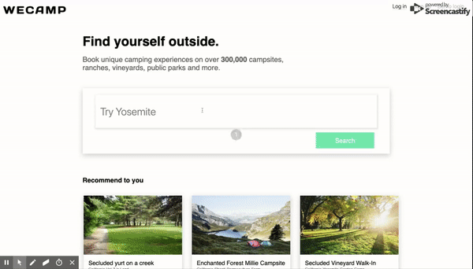
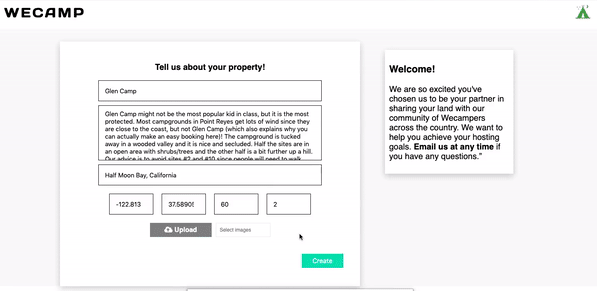

# Wecamp

## [Live demo](https://wecamp8.herokuapp.com/#/)

Wecamp is a clone of Hipcamp. User can browse campsite listings and book their trip. User can also manage their bookings. Wecamp also allows user to search campsites.

Wecamp is builded using Rails and PostgreSQL on backend, React and Redux on frontend.

## Features

- Secure frontend to backend user authentication using BCrypt to hash sensitive information.

- Allowing users to explore and book campsites, as well as create a new listing to host their campsites.

- User friendly management page for editing or deleting user's bookings.

- Equipped with keyword searching functionality and result rendering with Google Map API.

## Highlights

### Keyword Search

Upon entering a keyword to the search bar, the Rails backend controller will query the database to find potential results. These data is returned to the frontend over HTTP and is then dispatched to the Redux store, allowing them to be rendered on the customized Map React component.

### Multiple Images Upload

When user creates a new listing, Wecamp allows users to upload multiple images at the same time. Wecamp utilizes Amazon S3 and Rails' Active Storage to safely and efficiently store and manage images.

## Install

`$ git clone https://github.com/yinglanou19/WeCamp.git`

`$ cd WeCamp`

`$ npm install`

`$ bundle install`

Database initialization:

`$ bundle exec rails db:setup`

Deployment instructions:

`$ npm start`

`$ bundle exec rails s`

## Languages

Ruby
Javascript
HTML
CSS
